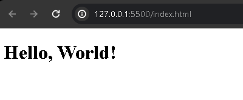

# HTML 5

A sigla HTML (**H**yper**t** **M**arkup **L**anguage) ou linguagem de marcação de hipertexto, é uma forma sistematizada para derivar estruturas em aplicações web com base em elementos que representa um conteúdo específico.

Geralmente os elementos, conhecidos por tags é uma forma de declarar um elemento específico que será apresentado ao cliente.

Essas representações que são renderizados pelos browsers (navegadores) são pre-definidas pelo CSS (Cascading Syle Sheets) o qual o próprio navegador faz essas configurações de estilos padrão nas tags HTML.

## Sintaxe Básica

Um elemento, conhecido como tag possui uma tag de abertura:

```HTML
<element_name>
```

O qual possui uma tag de fechamento depois do conteúdo:

```HTML
</element_name>
```

Nesses exemplos, o HTML tem suas denominações de sintaxe, que é a forma correta de se programar.

O maior exemplo que pode ser feito para entender como se escreve um elemento HTML, é o famoso `Hello, World`, como no exemplo abaixo:

```HTML
<h1>Hello, World</h1>
```

<div align="center">
  
</div>

Percebe-se que a tag de abertura é denominada por `<h1>`, o conteúdo entre a tag de abertura `<h1>` e de fechamento `</h1>`. Uso do sinal de menor(<), nome do elemento(h1), sinal maior(>), conteúdo, novamente sinal de menor(<), barra para direita (/), nome do elemento novamente (h1) e sinal de maior (>). Esses mininos detalhes são de extrema importancia e é a particularidade da escrita do propria linguagem de marcação de hipertexto.

## Orientação
É importante conhecer os elementos HTML e suas funcionalidades de como podem ser aplicadas e como se comportam. Porque existem varias tags de elementos que não possue a tag de fechamento. São denominadas por tags de *auto-fechamento* e tem um comportamento de uso para isso.

Por exemplo, tags HTML como:

```HTML


<meta>

<input>
```

Esses elementos tem seus devidos comportamentos para se comportarem da foram projetadas a se comportar como tags.