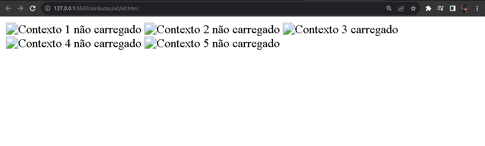

# HTML5 - Atributo alt

O atributo `alt` geralmente é utilizado para inserir uma acessibilidade e quando o contexto da imagem não for carregado por algum motivo, como alternativa será exibido o valor correspodente do `alt`.

  

> Exemplo de uso do atributo `alt` no arquivo `alt.html`