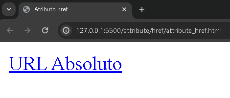
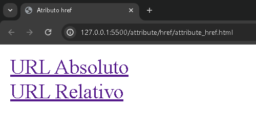
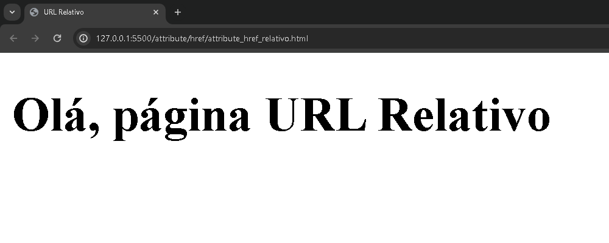

# href

O conceito de atributos são pré-configurações que define comportamentos específicos para uma respectiva tag.

No caso do atributo `href` possui uma funcionalidade de direcionar para um endereço especificado. Ou seja, o dominio (URL) para uma página.

O uso do atributo, a sintaxe básica de escrita é acompanhado:

```HTML
<element_name nome_atributo=""></element_name>
```

Dentre o nome da tag, com uma barra de espaço, se insere o/os atributo(s).

Existem certos atributos que não precisam de parâmetros para serem devidamente inseridos, passando os valores dentre as aspas ("").

Como mensionado, o atributo `href` aponta para uma URL especifica. Essa URL pode tornar um caminho absoluto ou relativo.

**URL Absoluto**

É quando se insere o dominio completo da página, como por exemplo: `https://exemplo.com`

**URL Relativo**

Esse dominio não é apontado para um URL e sim, aponta para um diretório correspondente. No documento dentro do site, por exemplo: `./src/img/exemplo.jpg`

Quando se utiliza esse apontamento para o diretório, quer dizer que "src" está dentro do diretório raiz (`/`) e que tem outra pasta para aponta na imagem correspodente.

> Observação: Ao apontar para outro diretório sem especificar no atributo, o servidor web normalmente pode retornar para o documento "index.html" dentro desse diretório.

# Na prática

Por exemplo,
```HTML
<a href="https://google.com">Aqui</a>
```
Ao clicar nesse elemento em um site, será direcionado para outro local. Como pode ver nos exemplos abaixo:

<div align="center">
  
  
</div>


Percebe-se que na primeira imagem, está na página principal da aplicação, ao apertar no `URL Absoluto`, a página será direcionada para a página inicial do google.

Nesse caso, no código, está inserindo uma URL Absoluta, direcionando para um outro lugar na página.

Como seria na URL Relativo?

É bem simples, usando o mesmo código, com a diferença para apontar os arquivos correspondente desse projeto:

```HTML
<a href="./attribute_href_relativo.html">URL Relativo</a>
```

<div align="center">
  
  
</div>

Como pode ver, se clicar no `URL Relativo`, vai ser direcionado para uma outra página que foi direcionada pelo diretório `./attribute_href_relativo.html` que está alocado no diretório desse projeto.