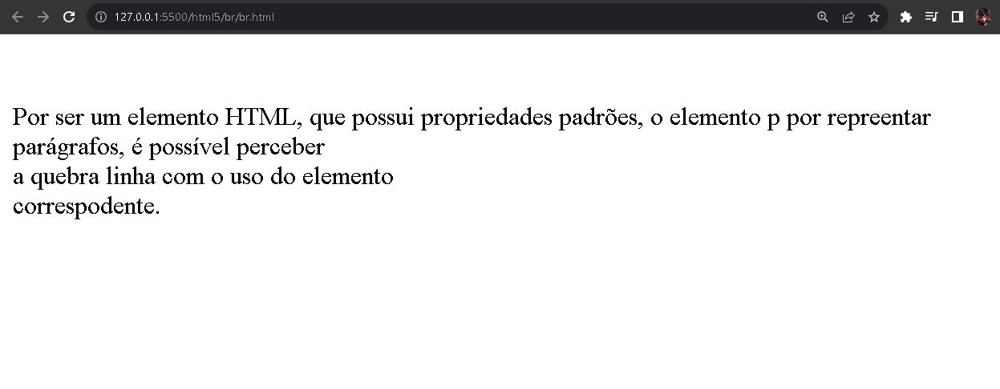

# Tag HTML - br

O elemento `<br>` serve para inserir uma quebra de linha entre textos ou elementos HTML.

Por exemplo,

```HTML
  <p>Por ser um elemento HTML, que possui propriedades padrões, o elemento p por repreentar parágrafos, é possível perceber <br> a quebra linha com o uso do elemento <br> correspodente.
```

Segue o exemplo da imagem abaixo,

<div align="center">
  
</div>

Percebe-se com a linha de código `br.html` que onde o elemento `br` estiver, realiza a quebra de linha correspodente.