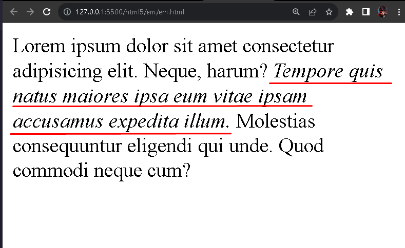

# Tag HTML - em

O elemento `em` no HTML é um elemento construtivo para textos, ele é utilizado para enfatizar o texto que está sendo envolvido pelo elemento `<em>`, servindo o envolvimento de forma itálica.

Podendo ser demostrado no exemplo abaixo,

  

É possível perceber o elemento `p` com as caracretisticas padrões do emmet do VsCode, quando se insere a palavra `lorem`, trazendo uma breve contextualização padrão de exemplo de descrição.

Ao envolvimento do texto com o elemento `em`, em destacaddo em vermelho na imagem, é possivel perceber a ocorrencia da entatização de forma itálica no texto.