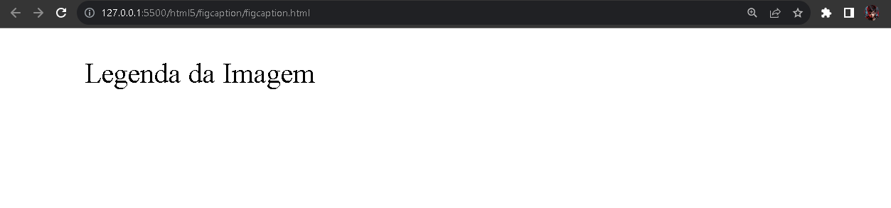
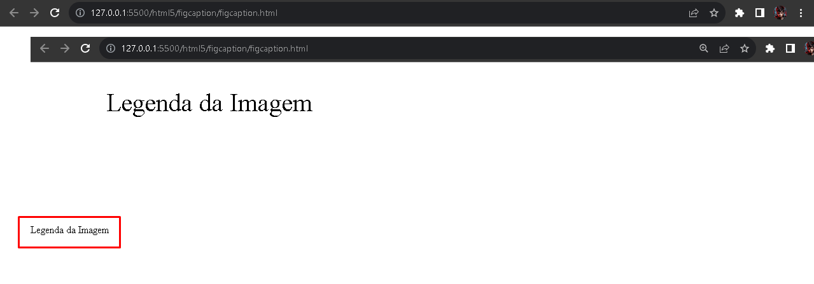

# Tag HTML - figcaption

O elemento `figcaption` é um complemento ao elemento `figure` que serve para inserir uma legenda na imagem agrupada ao elemento `figure`. O elemento `figcaption` geralmente é utilizada depois do elemento `img`.

  

É possivel perceber o agrupamento do elemento `figure` sem uma imagem denominada, porém no proximo exemplo o contexto muda.

  

É possível perceber que ao inserir o elemento `figure` acompanhado com o `img` e após isso, o elemento `figcaption`, denominasse como uma legenda as imagens inseridas.