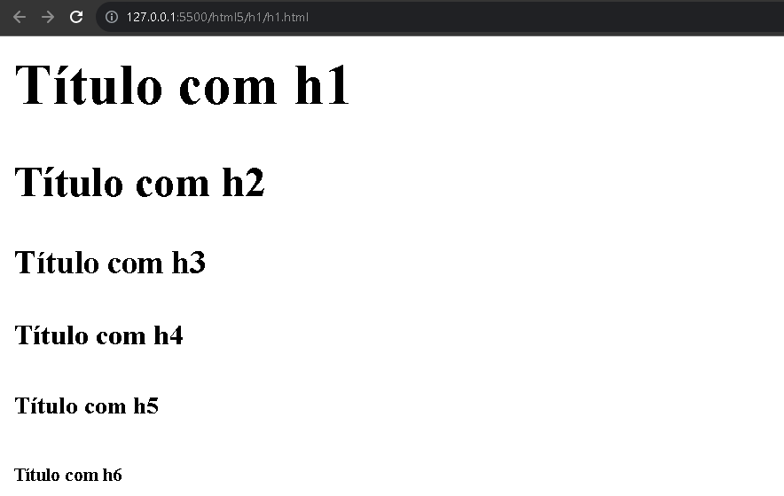

# Tag HTML - h1, h2, h3, h4, h5 e h6

A tag represetado com o `<h1>` é uma tag html/elemento tem suas derivações. São intruidas a demostrar um titulo de importância em um site. Quanto menor o número, maior importancia, quando maior for o número, menos importância significa.

Um `<h1>` tem mais importamcia na página do que um `<h2>` ou `<h3>` e assim sucessivamente ate o `<h6>`

Como destacado no exemplo abaixo,

  

Tag HTML - h1: um elemento HTML que corresponde o coonteúdo exibido como um título da aplicação. 

Existindo as suas devidas variações: h1, h2, h3, h4, h5 e h6

Cada elemento com a inúmeração menor representa maior importância. Se a inumeráção for maior, na aplicação representa menos destaque.

Geralmente essas tags são utiloizadas para definir títulos na aplicação e subtitulos com suas derivações de um contexto principal que é agrupada com seus contexto especifico.
