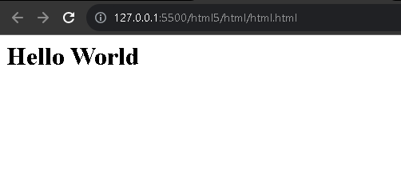

# Introdução ao HTML5

HTML (Hypertext Markup Language) ou melhor, a tradução - "Linguagem de Marcação de Hypertexto" é uma linguagem de marcação que define as estruturas básicas para um site, dando propósito aos elementos que são exibidos no browser.

# Sintaxe no HTML5

A sintaxe, é a maneira de como deve ser escrita. Assim como o idioma português possui uma forma escrita, com padrões e regras, na linguagem de programação segue o mesmo contexto. No HTML5 não seria diferente.

No HTML existem os elementos que são introduzidos por tags, que dão proposito no site. Funcionando da seguinte forma de escrever códigos HTML

```HTML
<h1>Hello World</h1>
```

Recebece na imagem abaixo, a forma que o browser intrepeta uma tag e como esse elemento está sendo exibido. 

<div align="center">
  
</div>

<br>

O qual tem suas respetivas aberturas `<h1>` acompanhadas com o conteúdo e o fechamento `</h1>`

É importante ressaltar que ao depender do contexto da tag, algumas tags não v ão precisar de fechamento, apenas acompanhado com `>`

# Tópicos que devem ser considerados
- Todo elemento HTML tem uma intrepetação pelo browser, dando proriedades espeficias por padrão.
- Atributos podem ter contexto padrões e devem está ciente da existencia desses padrões para serem modificados.
- Saiba quando utilizar comentários, no começo de estudos é interessante introduzir, porém, quando possuir dominio, é necessário evitar utiliza-las.
- E por ultimo, existem certos caracteres que existem  uma sintaxe espeficica para serem inseridas, inserindo simbolos como `<, ', >, /` com o uso do `&` com o nome espeficio com `;` para evitar conflitos de compilação do HTML5.
