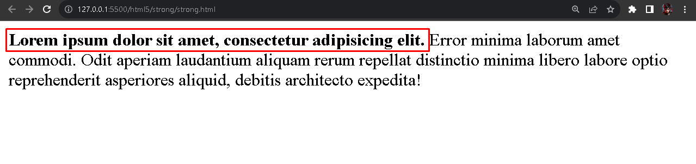

# Tag HTML - strong
O elemento denominado como `<strong>` serve para indicar um texto em destaque, possuindo grande importância. De forma negrita.

  

É possível perceber em destaque, que o elemento `strong` está agrupando alguns caracteres do texto a serem destacados como de grande importância.