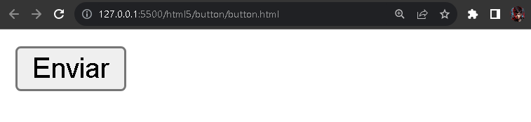
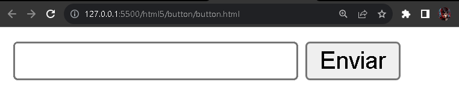

# `<button>`

A representação do botão em HTML é definido pela tag `<button>`, que insere um botão clicavél na página.

Essa tag é geralmente utilizada em formulários (`<form>`) quando o usuário clicar em um elemento botão (`<button>`) após informas os dados de entrada pelos `<input>`, é provavel que seja necessário inserir o atributo `submit`  para que os dados inseridos sejam encaminhados para URL de forma correta.

Logo abaixo um exemplo de código HTML do elemento `<button>`

```HTML
<button>Enviar</button>
```

Em seguida a exibição,

<div align="center">
  
</div>

É possível perceber que o proprio navegador traz propriedades pré-estilizadas para a exibição do elemento `button`

Ao inserir um elemento `button` abaixo de um elemento `input` por exemplo, mesmo inserido um abaixo do outro, no navegador estão um ao lado do outro. É mostrado adiante na imagem abaixo:

<div align="center">
  
</div>

Isso ocorre porque os elementos `input` e `button` são elementos em linha (inline) o qual demostra a exibição informada.

O inline é um comportamento dos elementos estarem alinhados no HTML


## Em relação do elemento button e form

Na criação do elemento `button` dentro de um elemento `form` possui um comportamento padrão. Quando o usuário clica no botão para encaminhar as informações, isso é por padrão mas não é esplicito na aplicação.

Para não causar esses conflitos, é recomendado inserir o atributo `type` acompanhado com o valor `submit` ao elemento `button` para deixar claro que o elemento `button` é o elemento de envio do formulário.