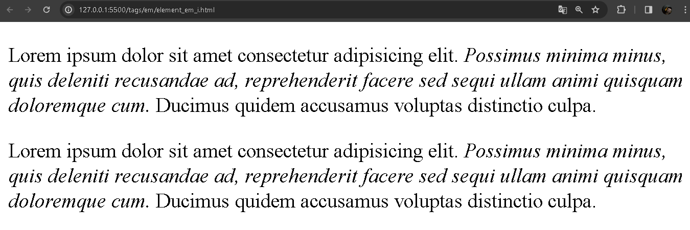

# `<em>` e `<i>`

O elemento `em` no HTML, tem um propósito de uso para textos, de forma que enfatize o texto de forma itálica.

Tanto a tag `<em>` e `<i>` possui esses comportamentos mensionados em seus conteúdos, os textos, tornem de forma itálica.

Pode-se ver nos exemplos a seguir o uso dessas respectivas tags:

Exemplo `<em>`:

```HTML
<p>
 Lorem ipsum dolor sit amet consectetur adipisicing elit. <em>Possimus minima minus, quis deleniti recusandae ad, reprehenderit facere sed sequi ullam animi quisquam doloremque cum.</em> Ducimus quidem accusamus voluptas distinctio culpa.
</p>
```

Exemplo `<i>`:

```HTML
<p>
  Lorem ipsum dolor sit amet consectetur adipisicing elit. <i>Possimus minima minus, quis deleniti recusandae ad, reprehenderit facere sed sequi ullam animi quisquam doloremque cum.</i> Ducimus quidem accusamus voluptas distinctio culpa.
</p>
```

<div align="center">
  
</div>


É possível perceber que na imagem a cima, tanto as tags `<em>` e `<i>` estão itálicos e tem o mesmo comportamento.

A diferença está na semântica, de como o conteúdo tem significado na página.

O elemento `<em>` tem mais destaque de ser ênfatizado, enquanto que o `<i>` é simplismente enfatizado a ser um texto de forma itálica.