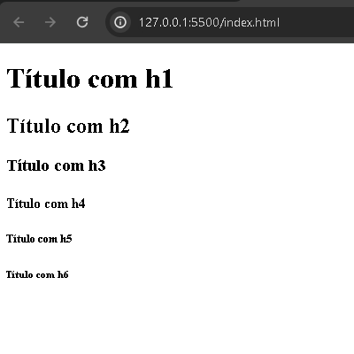

# `<h1>`, `<h2>`, `<h3>`, `<h4>`, `<h5>` e `<h6>`

O elemento representado como `<h1>`, possui seis várições de cabeçalhos servindo para indicar títulos de vários tamanhos e espessuras. 

A tag pode ser inumerada do `<h1>` ao `<h6>` e essa derivação quanto maior a númeração, terá texto maior e mais grosso renderizado no navegador. Quanto menor a derivação, é mais menor e fino, até o nível de parágrafo.

Assim como inumeradas e inseridas, essas tags são instruidas para demonstrar um titulo, quanto maior é instruida, mais importante é na aplicação.

Como pode ser demostrado no exemplo abaixo, o uso da tag `<h1>` e suas derivações:

```HTML
<h1>Título com h1</h1>
<h2>Título com h2</h2>
<h3>Título com h3</h3>
<h4>Título com h4</h4>
<h5>Título com h5</h5>
<h6>Título com h6</h6>
```
É importante observar que:

- `<h1>` define o título mais importante.
- `<h6>` define o título menos importante

<div align="center">
  
</div>

Como pode-se ver no exemplo tanto no código e na imagem, o navegador define estilizações para cada tag `<h1>` com suas váriações.

Todos esses elementos são intruidas a um contexto ou conteúdo principal da aplicação, pelo qual, conforme a aplicação se desenvolve, pode-se inserir contextos para serem utilizados.