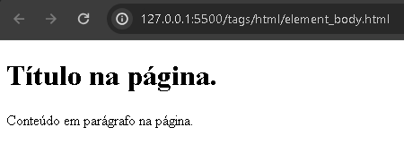

# `<head>`

A tag `<head>` é um elemento responsável por configurar as configurações principais da página.

Geralmente, as informações que são introduzidas não são exibidas na página principal do navegador mas, tem as informações sobre o documento HTML. Por exemplo, os metadados, folhas de estilos e scripts externos.

Declaração padrão da tag:

```HTML
<!DOCTYPE html>
<html lang="pt-br">
  <head>
    ...
  </head>
</html>  
```

<div align="center">
  
</div>

No exemplo acima, por ser um elemento de configuração, geralmente as informações dentro dessa tag não são visiveis para o usuário.

Porém, no exemplo abaixo, é possível ver as configurações, que são visiveis porém não na página principal:

<div align="center">
  
</div>

Nesse exemplo, é utilizado uma tag `<title>` que será introduzida em breve, porém é para mostrar que o conteúdo da tag `<head>` armazena informações de configurações que não são exibidas para o usuário.

A tag `<head>` é o segundo elemento `child` da tag `<html>`. Tem o comportamento, anteriomente mensionado, o conteúdo são as principais configurações do documento e podem ser inseridos algumas tags que serão abordados logo abaixo.

## `<title>`

A tag `<title>` é um elemento de configuração que tem uma um comportamento de inserir títulos na aba/janela da página no navegador. 

Geralmente o texto é escrito entre esta tag de abertura e fechamento, o qual o conteúdo será exibido na barra de navegação.

No código abaixo, uma simples demostração de uso:

```HTML
<!DOCTYPE html>
<html lang="pt-br">
  <head>
    <title>Conteúdo de Configuração</title>
  </head>
</html>
```

É possível perceber a seguir, que assim como mensionado o comportamento do elemento `head`, o `title` é um dos meios de configuração para exibir o nome na barra da página:

<div align="center">
  
</div>

Percebe-se que no topo da página, o conteúdo da tag `<title>` está sendo exibido na aba da página? 

Pois então, é esse comportamento que a tag `<title>` possui.


# `<body>`

A tag `<body>` é um elemento que possui um comportamendo de exibir as tags estruturadas na aplicação para o usuário. Ou seja, é exibida aos usuários, todo o conteúdo da aplicação.

Pode ver no código abaixo, a onde a tag mensionada deve ser inserida:

```HTML
<!DOCTYPE html>
<html>
  <head></head>
  <body>
    ...
  </body>
</html>
```

Percebe-se na estrutura "básica" do documento HTML, que a tag `<body>` tem como `parent` a tag `<html>` e o `<body>` é o `child`, na DOM. 

Como mensionado, essa parte, o conteúdo estruturado por tags é inserido no `<body>` para exibir as informações na página inicial, como pode ser mostrado na imagem a seguir:

<div align="center">
  
</div>

É possível perceber que dentro do conteúdo da tag `<body>` tem outras tag sendo exibidas, como pode ver as tags `<h1>` e `<p>`, como demostrado no código fonte logo abaixo:

```HTML
<!DOCTYPE html>
<html>
  <head></head>
  <body>
    <h1>Título na página.</h1>
    <p>Conteúdo em parágrafo na página.</p>
  </body>
</html>
```