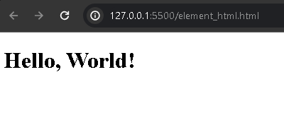

# `<html>` e `<!DOCTYPE>`

Em HTML, em todo começo antes de programar códigos em HTML, é necessário criar um arquivo com a devida extensão `.html` ou `.htm`, para que o browser consiga intrepetar que isto é um arquivo HTML e que possa realizar as devidas renderizações de elementos na página. Porém é necessário de um outro requisito que será abordado logo abaixo. 

Ambas as extensões mencionadas funcionam porém é utilizados por grande parte dos desenvolvedores a extensão `.html`

## Identificador para o Browser: `<!DOCTYPE>`

O `<!DOCTYPE>` é uma declarativa que deve ser incluida no topo do documento HTML, antes mesmo da tag `<html>`. Ele é responsável por definir a versão HTML utilizada no documento correspondente, nesse caso é HTML 5.

Porém toda declarativa tem acompanhamento de uma identificação, uma forma do navegador entender e renderizar com os devidos recursos, que esse arquivo, é um documento HTML:

```HTML
<!DOCTYPE html>
```

Essa flag `html` é um parametro para identificação, de forma que o navegador intrepete que isso é um documento HTML.

A ausencia do `<!DOCTYPE html>` o navegador tendem a utilizar outras formas de renderização diferente de costume, causando certas incompatibilidade em alguas especificações de elementos, comportamentos, tags, dentre outros.


## O corpo do documento HTML

A tag `<html>` é um elemento responsavel por agrupar todo o documento HTML e inclusive as demais tags HTML. 

Responsável por renderizar a página e todos as tags inseridas dentro, nenhuma marcação deve vir depois da tag de fechamento `</html>`.

Na tag de abertura, o atributo `lang` é acompanhado, serve para declarar o principal idioma da página (ou seja o conteúdo introduzido).

```HTML
<html lang="pt-br">
</html>
```

É essa tag que o browser realiza a intrepetação de todo o documento após a identificação da declarativa `<!DOCTYPE html>`. Que então, renderizará os elementos HTML com sua devida estrutura programada.

Por exemplo, de código HTML:

```HTML
<!DOCTYPE html>
<html>
  <h1>Hello, World!</h1>
</html>
```

Dessa forma, o navegador além de identificar a extensão do arquivos, do código acima, ele renderiza a tag `<h1>` com seu devido comportamento, proposito de uso e com as pré-estilizações definidas pelo browser.

<div align="center">
  
</div>