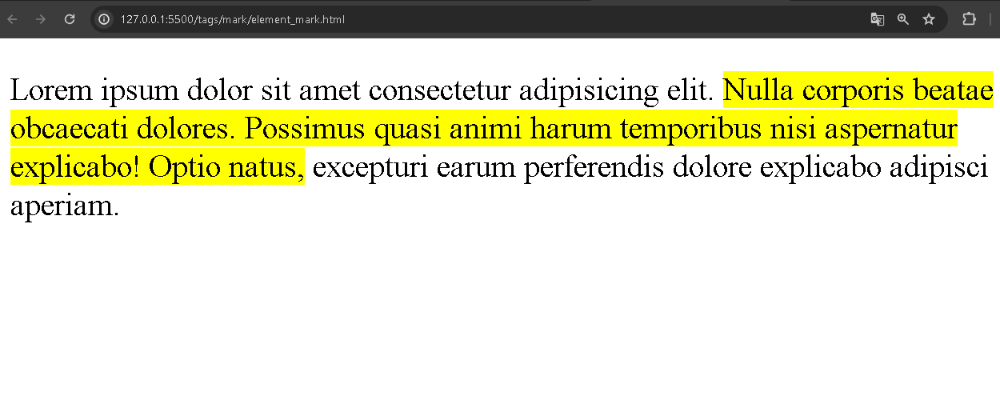

# `<mark>`

A tag `<mark>` é um elemento que tem um comportamento de destacar conteúdo de textos, como uma marcação, demostrando relevância ao conteúdo.

No código abaixo, é possível perceber o uso dessa tag:

```HTML
<!DOCTYPE html>
<html>
  <head>
    <title>Tag mark</title>
  </head>
  <body>
    <p>Lorem ipsum dolor sit amet consectetur adipisicing elit. <mark>Nulla corporis beatae obcaecati dolores. Possimus quasi animi harum temporibus nisi aspernatur explicabo! Optio natus,</mark> excepturi earum perferendis dolore explicabo adipisci aperiam.</p>
  </body>
</html>
```

Com as devidas configurações de site já vistas, o elemento mark tem um comportamento de marcar conteúdo em texto, tendo a sintaxe de abertura, conteúdo e fechamento. Dentro do conteúdo, será marcado com estilizações do propria tag `<mark>` que o browser renderiza esse proposito definido pela tag:

<div align="center">
  
</div>