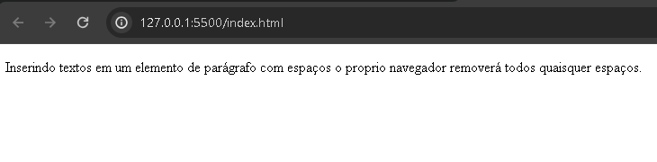

# `<p>`

O elemento da respectiva tag `<p>` representa parágrafos no documento HTML. Essa tag pode introduzir qualquer caractere, textos, dígitos, etc. Dando enfase de representividade de um conteúdo/parágrafo em texto.

Podendo ser declarado da seguinte maneira:

```HTML
<p>Conteúdo do parágrafo</p>
```

<div align="center">
  
</div>

Possui as mesmas particularidades de sintaxe básica no HTML, possui:

- possui tag de abertura: `<p>`
- possui conteúdo: `Conteúdo do parágrafo`
- possui tag de fechamento: `</p>`

Esse elemento tem representividade de parágrafos em HTML.

Em caso de inserir quaisquer espaços e linhas extras no conteúdo da tag, como no código abaixo:

```HTML
<p>Inserindo textos em um
  elemento de parágrafo
  com espaços
  o proprio
  navegador
  removerá todos os
  espaços.
</p>
```
Quando o elemento for renderizado na página, o proprio navegador removerá esses espaços correspondentes, como pode ser visto logo abaixo:

<div align="center">
  
</div>

É um comportamento padrão do navegador porém existe formas de quebrar espaços ou inserir quebras de linhas.

## Alternativas
A primeira solução é inserir um outra tag `<p>` abaixo do fechamento da primeira tag `<p>`, como pode ser mostrado no código abaixo:

```HTML
<p>Conteúdo do primeiro parágrafo</p>

<p>Conteúdo do segundo parágrafo</p>
```

Assim, haverá uma quebra de linha, como pode-se ver no exemplo abaixo, renderizado pelo browser:

<div align="center">
  
</div>

Outra forma é inserir a tag `<br>`. É um elemento responsavel para inserir quebras de linhas. Serve para inserir essas quebras, no exemplo abaixo, acompanhado com a tag `<p>`, é possível perceber o seu uso:


```HTML
<p>
  Breve contextualização sobre o elemento br<br>
  Esse elemento tem um comportamento de realizar quebras de linhas em conteúdos e entre tags, dando um espaçamento de quebra de linha.<br>
  Para mais informações, consulte nesse repositório sobre o elemento br.
</p>
```

Percebe-se que a forma de como o conteúdo está sendo distribuido, é uma maneira visual, para facilitar a leitura do código, `conceito de identação`. 

<div align="center">
  
</div>

Além disso, a tag `<br>`, como utilizada no código, percebe-se no comportamento que realizou no exemplo acima, realizando a quebra de linha no conteúdo da tag `<p>`
