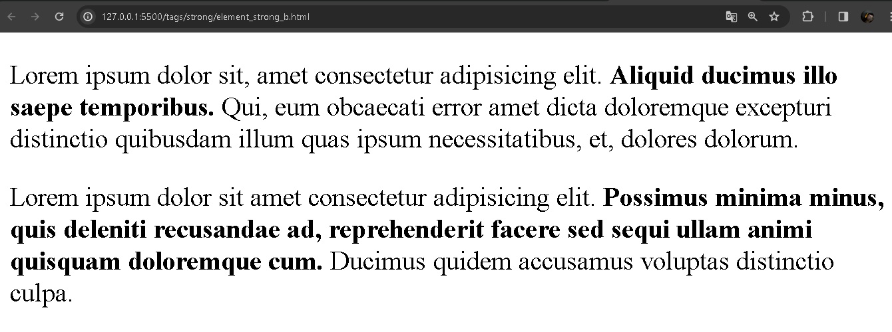

# `<strong>` e `<b>`

A tag `<strong>` e `<b>` tem quase as mesmas particularidades de uso, o conteúdo dentro dessas tag, tem o conteúdo destacado. Em textos, tem um comportamento de `negrito`. 

Pode-se ver nos dois exemplos abaixo, o uso da tag `<strong>` e `<br>`:

Exemplo para tag `<strong>`:

```HTML
<p>
 Lorem ipsum dolor sit amet consectetur adipisicing elit. <b>Possimus minima minus, quis deleniti recusandae ad, reprehenderit facere sed sequi ullam animi quisquam doloremque cum.</b> Ducimus quidem accusamus voluptas distinctio culpa.
</p>
```

Exemplo para ta `<b>`:

```HTML
<p>
  Lorem ipsum dolor sit amet consectetur adipisicing elit. <b>Possimus minima minus, quis deleniti recusandae ad, reprehenderit facere sed sequi ullam animi quisquam doloremque cum.</b> Ducimus quidem accusamus voluptas distinctio culpa.
</p>
```

<div align="center">
  
</div>

Como é possível ver na imagem acima, o código em sendo exibido no navegador. Ambos os textos estão destacados no conteúdo da tag, tanto no `<strong>` e no `<b>`.

Mas então, qual a diferença? Tem conceitos teóricos sobre semântica.

`Semântica` de forma bem breve, é como a estrutura no documento HTML está sendo semânticamente identificavel e acessivel aos bots de buscadores. De forma que se a construção do documento HTML for bem arquitetado na semântica, é mais acessível a intrepetação.

Isso serve para melhorar essa acessibilidade e para o código construido em HTML, seja bem acessível, de forma que cada conteúdo, tem significado na página.

Enquanto que o elemento `<strong>` é utilizado para indicar que o conteúdo do texto é SEMANTICAMENTE importante no texto. Enquanto que na tag `<br>` é destacado mas não indica tanto importância, é apenas representa um simples texto em negrito.